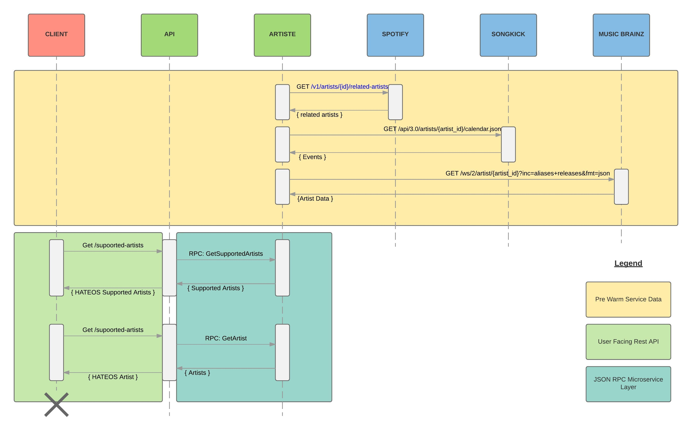
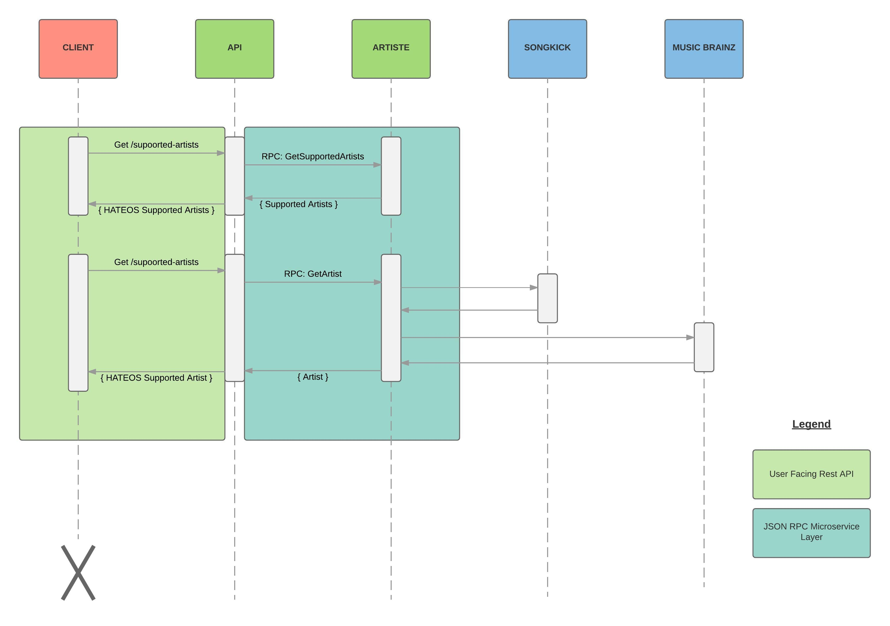

# Coding Challenge

## Introduction

During a recent interview process I was asked to work to produce a golang project to demonstrate proficiency in golang. 
I spent a few hours on this but ultimately the startup decided to recruit a front end developer rather than a backend one. 

Ah well! 

As I'm currently looking for a golang software engineer position I've posted this here anonymously. 
(I'm still in a job at the moment). 

## The Brief

> We would like to continue with your application and would like to ask you to complete a little coding exercise to help us evaluate your thinking and code style.
The goal is to build a microservice and a RESTful API using data related to music artists/bands (we recommend you use 3 or 4 artists/bands). You can think of it as a mini Music Hack Day, where you have the freedom to build a little microservice that provides some functionality using the artist/band data, and exposes the results via a RESTful API
We will be evaluating:
> * Your way of thinking and creativity. 
> * Your code style. 
> * Your ability to build microservices and interact with them via RESTful APIs.
> Please work to the following guidelines:
> * Microservice should be built using a language of your choice (preferred Golang) 
> * RESTful API should be powered by a language of your choice (preferred Node.js or Golang) 
> * Testing is required for the API. 
> * It should be possible for us to deploy and run the app locally on our machines with a few commands. 
> * There is no need to set up a database. You could just capture data in memory or save it locally - we are happy so long as it works when we run it in our machines, i.e, one option could be that the microservice is responsible for capturing data via open APIs and then perform some sort of data crunching to produce an output. 

## The Response 
 
In response to the coding challenge assigned I chose to create a quick 'Artist Profile'. The 
idea is that the profile contains: 
 
 - Artist Data From Music Brainz 
 - Upcoming Events From Stub Hub
 - Related Artists From Spotify
 
Over the course of the last few evenings I've been working to complete this and as you will see 
changed the scope to fit the time I have available. 
  
In order to meet the deadline I'm providing you with an incomplete application. Here is a list of the things
I'm believe I've to demonstrated and an indication of what is still left to do. 
 
- [x] API Design (See contract doc and diagrams below)
- [x] Golang TDD (see Ginkgo, Gomega, Counterfieter, MockHttp testins)
- [x] Integration into Music APIs (2/3 - Not all fields implemented)
- [x] GoKit JSON RPC implementation
- [ ] REST API with Gorilla MUX
- [ ] End To End REST > RPC > Music API Integration  
- [ ] Concurrency - Would like to apply to [The Service](artiste/dataservice/artist.go#L38) 
- [x] Docker
 
I'm happy to complete any of the remaining tasks but wont be able to do this until next week. 
Think of this as a preview with a chance to feed back on where you need further demonstration of competency.   
 
## Design & Architecture

You can find the API Blueprint for the as yet unimplemented REST API at: http://docs.artiste.apiary.io/

When first analysing the requirements I thought that this architecture would provide the best run 
time performance.


 
However as I began to work through the features it proved simpler to conduct the requests in response to the 
request.   
 
 
 
In the task you specified that the microservice should be REST, I altered this to be JSON RPC. I'm open to 
developing REST microservices but consider adopting the REST constraints *behind your own service boundries* 
a little overkill. I think that the public API makes a great candidate for REST. I look forward to having this 
discussion with you in person!  
  
 
## Issues 
 
- [ ] Spotify requires authentication for the related artists method, didn't have time to implement their flow
- [ ] Song Kick API requires an offline issued token (I applied, they haven't responded)
- [ ] Musicbrainz frequently rate limits
- [ ] I'm trying out a new IDE Gogland, apologies if the go fmt / style cop isn't always applied. I'm working on it! 

As a result of this and in the spirit of the Hack I stubbed out these dependencies using a simple http relay server.

## Running The RPC Service

`docker-compose up -d`
 
 ```
 curl -XPOST --data '{ "name": "Jimmy Eat World" }'  http://192.168.99.100:8082/GetArtist
 ```

## Running The Tests

Required:  
- [Glide](https://github.com/Masterminds/glide)
- [Ginkgo](https://onsi.github.io/ginkgo/)
- The application is in your go path

```
docker-compose up -d stubs # If not running from the demo above
cd artiste
glide install
ginkgo -r
```